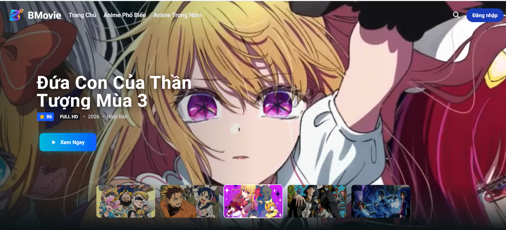

# BMovie - Nền tảng xem phim tích hợp nhiều nguồn

  

##  Tổng quan
BMovie là nền tảng streaming anime tối ưu hiệu năng, tập trung vào trải nghiệm người dùng mượt mà và khả năng tải dữ liệu thông minh. Dự án là tâm huyết cá nhân, giải quyết bài toán về tối ưu API và tốc độ phản hồi hệ thống.

## Công nghệ sử dụng (Tech Stack)
*   **Frontend:** Next.js (App Router), Tailwind CSS, Shadcn/UI.
*   **Backend & APIs:** NestJS, AniList GraphQL API.
*   **Database & Tối ưu:** MongoDB, Redis (Caching), ISR (Incremental Static Regeneration).

## Điểm nhấn kỹ thuật (Engineering Highlights)
*   **Tối ưu SEO:** Chuyển đổi cấu trúc URL từ ID sang **Slug-based routing**, giúp tăng khả năng index trên các công cụ tìm kiếm.
*   **Hiệu năng vượt trội:** Sử dụng **ISR (Incremental Static Regeneration)** để cân bằng giữa hiệu suất trang tĩnh và tính cập nhật dữ liệu (tự động revalidate mỗi 600s).
*   **Backend Resilience:** Áp dụng **Redis caching** tại tầng server để giảm thiểu truy vấn API thừa, tối ưu hóa độ trễ.
*   **Bảo mật:** Phát triển bộ giải mã (Custom Loader) tùy chỉnh để xử lý và bảo vệ luồng dữ liệu `m3u8`.
*   **Trải nghiệm người dùng:** Tích hợp **Autocomplete** nâng cao, hỗ trợ tìm kiếm nhanh và chính xác.

##  Cấu trúc Route
| Route | Mô tả |
| :--- | :--- |
| `/home` | Trang chủ với Banner, danh sách phim nổi bật được cache bằng ISR. |
| `/info` | Thông tin chi tiết và danh sách tập phim, sử dụng Server-side caching. |
| `/stream` | Giao diện phát video tối ưu hóa, hỗ trợ stream an toàn. |
| `/search` | Tìm kiếm toàn văn bản với hỗ trợ Autocomplete. |
| `/anime-*` | Các danh sách tổng hợp theo trend và năm, tối ưu với pagination. |

##  Lộ trình phát triển
*   **Hệ thống xác thực:** Đang hoàn thiện cơ chế bảo mật với `sessionToken` và `refreshToken`.
*   **Tính năng thông minh:** Gợi ý danh sách các mùa phim liên quan ngay tại trang chi tiết để tối ưu trải nghiệm theo dõi liên tục.
*   **Tương tác thời gian thực:** Tích hợp **WebSockets** để triển khai hệ thống bình luận trực tiếp cho từng tập phim.
*   **Cá nhân hóa:** Xây dựng Avatar người dùng năng động với Shadcn/UI.